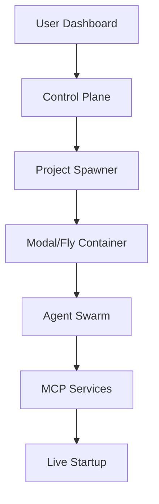

# my-yc: AI-Powered Startup Incubator

> Transform ideas into reality with autonomous AI agents. Be the YC of your own startup portfolio.

## 🚀 Vision

**my-yc** is a revolutionary platform that allows anyone to become their own Y Combinator. Users submit business ideas and receive fully autonomous AI agent swarms that handle everything from market research to deployment - creating complete startups with minimal human intervention.

### Key Differentiators
- **Full-Stack Execution**: Beyond brainstorming - agents build real products
- **Autonomous Operation**: Projects run independently after launch
- **Zero Idle Costs**: Serverless architecture scales to zero
- **MCP Integration**: Leverages cutting-edge Model Context Protocol
- **Portfolio Management**: Manage multiple startups like a VC

## 🏗️ Architecture

### Core Innovation: Autonomous Spawn-and-Forget Projects

Each startup becomes a **self-contained, autonomous entity** that provisions its own infrastructure, manages its own services, and runs independently after launch. This eliminates ongoing operational costs for the platform.

### Two-Tier System Design



#### Control Plane (my-yc.com)
```
my-yc/
├── apps/
│   ├── web/                    # Next.js 15 dashboard
│   │   ├── project-launcher/   # UI for idea submission
│   │   ├── portfolio-view/     # Monitor all projects
│   │   └── billing/           # Stripe integration
│   └── orchestrator/           # FastAPI service
│       ├── spawn-manager/      # Modal/Fly.io API
│       ├── mcp-registry/       # Available MCP servers
│       └── project-tracker/    # PostgreSQL state
```

#### Execution Plane (Project Instance Template)
Each project runs in isolated containers with:
```
project-instance/
├── agents/
│   ├── coordinator.py          # LangGraph orchestration
│   ├── frontend_agent.py       # MCP: Lovable, Vercel
│   ├── backend_agent.py        # MCP: Supabase, GitHub
│   └── business_agent.py       # MCP: Email, Stripe
├── mcp-servers/
│   ├── supabase-provisioner/   # Creates Supabase projects
│   ├── vercel-deployer/        # Deploys to Vercel
│   └── email-creator/          # Provisions email accounts
└── project-state/
    └── state.json              # Persistent project config
```

## 🤖 Agent Architecture

### MCP-Enabled Agent Capabilities

```yaml
├── Frontend Agent
│   ├── MCP: Lovable (UI generation)
│   ├── MCP: Figma API (design assets)
│   └── MCP: Vercel (deployment)
├── Backend Agent
│   ├── MCP: Supabase Management API (database)
│   ├── MCP: GitHub API (code repository)
│   └── MCP: Railway/Render (deployment)
├── Business Agent
│   ├── MCP: Resend API (email provisioning)
│   ├── MCP: Stripe API (payment setup)
│   └── MCP: Google Workspace (domain/email)
└── Coordinator Agent
    ├── MCP: Slack API (team workspace)
    ├── MCP: Linear API (project management)
    └── MCP: Cloudflare (DNS/CDN)
```

### Autonomous Capabilities

Each project can:
- 📧 Create its own email address
- 🗄️ Set up its own database
- 🌐 Deploy its own website
- 💳 Accept its own payments
- 👥 Email its own customers
- 📊 Analyze its own metrics

## 🔄 Project Lifecycle

```
User Idea → Control Plane → Spawn Container → Agent Swarm →
Service Provisioning → Autonomous Deployment → Sleep (£0 cost) →
Wake on Demand → Continuous Evolution
```

### Example Flow
1. User submits: "AI-powered recipe recommender"
2. Control plane spawns Modal container
3. Agents autonomously:
   - Research market & competitors
   - Design UI in Lovable
   - Create Supabase database
   - Build Next.js frontend
   - Deploy to Vercel
   - Set up Stripe payments
   - Create email campaigns
4. Container sleeps (zero cost)
5. Startup operates independently

## 🛠️ Technology Stack

### Core Infrastructure
- **Containers**: Modal.com (primary) / Fly.io (alternative)
- **Agent Framework**: LangGraph for orchestration
- **MCP Integration**: Model Context Protocol for service access
- **Frontend**: Next.js 15 + TypeScript + Tailwind CSS + shadcn/ui
- **Backend**: FastAPI (Python) for agent orchestration + Node.js for real-time updates
- **Database**: PostgreSQL + Redis (job queues) + Pinecone (vector store)
- **Real-time**: WebSockets for agent progress streaming
- **Auth**: Clerk or Auth0 for rapid implementation

### Agent Tools (via MCP)
- **UI Generation**: Lovable, v0, Figma
- **Database**: Supabase Management API
- **Deployment**: Vercel, Railway, Render
- **Communication**: Resend, SendGrid, Twilio
- **Payments**: Stripe Connect
- **Infrastructure**: Cloudflare, AWS

## 🔒 MCP Integration Details

### Autonomous Service Provisioning Flow

```python
# Example: Backend Agent creating Supabase project
class BackendAgent:
    async def provision_infrastructure(self):
        # 1. Create Supabase project via Management API
        supabase_project = await mcp.execute(
            server="supabase-provisioner",
            action="create_project",
            params={
                "name": f"{project_id}-backend",
                "region": "us-east-1",
                "plan": "free"
            }
        )

        # 2. Store credentials in project vault
        await vault.store({
            "supabase_url": supabase_project.url,
            "supabase_anon_key": supabase_project.anon_key
        })

        # 3. Initialize database schema
        await mcp.execute(
            server="supabase-sql",
            action="run_migrations",
            params={"project_id": supabase_project.id}
        )
```

### MCP Security Architecture
```yaml
Credential Management:
├── Master Vault (Control Plane)
│   ├── Platform API keys (Supabase, Vercel master accounts)
│   └── Encrypted with AWS KMS
├── Project Vault (Per Instance)
│   ├── Generated service credentials
│   ├── Ephemeral tokens with expiry
│   └── Destroyed on project termination
```

### Security & Isolation
```yaml
Isolation Layers:
├── Network: Each project in separate VPC/namespace
├── Compute: Hardware-isolated containers (KVM on Fly)
├── Credentials: Scoped OAuth tokens with least privilege
├── Rate Limits: Per-project API quotas
└── Monitoring: Anomaly detection on resource usage
```

## 💰 Cost Optimization Strategy

### Modal.com Implementation (Recommended)
```python
# Spawn project with auto-sleep
@modal.function(
    cpu=2,
    memory=4096,
    timeout=3600,  # 1 hour max runtime
    schedule=modal.Cron("0 */6 * * *")  # Wake every 6 hours
)
async def project_executor(project_id: str):
    # Load project state
    # Run agent tasks
    # Sleep when done (zero cost)
```

### Alternative: Fly.io Machines
```toml
# fly.toml for project instance
[http_service]
  auto_stop_machines = true      # Stop when idle
  auto_start_machines = true     # Wake on request
  min_machines_running = 0       # Scale to zero
```

### Revolutionary Economics
- **Initial Spawn**: $0.50-2.00 per project (one-time)
- **Idle Projects**: $0.00 (containers sleep automatically)
- **Active Runtime**: $0.0001/second when working
- **User Pays**: $29-299/month subscription
- **Platform Cost**: ~$5-20/month in actual compute

### Pricing Tiers
- **Starter** ($29/mo): 1 active project, basic agents
- **Growth** ($99/mo): 5 active projects, all agents
- **Scale** ($299/mo): Unlimited projects, priority processing
- **Enterprise**: Custom pricing, dedicated resources

## 🚦 Development Roadmap

### Phase 1: MCP Foundation (Weeks 1-2)
- [ ] Set up basic MCP server for GitHub operations
- [ ] Create Modal.com spawner for isolated containers
- [ ] Test agent creating its own GitHub repository
- [ ] Implement secure credential vault system

### Phase 2: Service Provisioners (Weeks 3-4)
- [ ] Supabase MCP server (project creation)
- [ ] Vercel MCP server (deployment)
- [ ] Resend MCP server (email provisioning)
- [ ] Test full autonomous provisioning flow

### Phase 3: Agent Orchestration (Weeks 5-6)
- [ ] LangGraph multi-agent coordinator
- [ ] Frontend agent with Lovable MCP integration
- [ ] Backend agent with Supabase MCP integration
- [ ] End-to-end project generation pipeline

### Phase 4: Production Platform (Weeks 7-8)
- [ ] User dashboard (Next.js)
- [ ] Billing integration (Stripe)
- [ ] Real-time project monitoring via WebSockets
- [ ] Security hardening & rate limiting

## 🏃‍♂️ Getting Started

### Prerequisites
- Node.js 18+
- Python 3.11+
- Docker & Docker Compose
- Modal.com account (free tier available)

### Local Development

```bash
# Clone and setup
git clone https://github.com/your-org/my-yc.git
cd my-yc
npm install

# Start development environment
docker compose up --build

# Launch test project
python scripts/spawn_test_project.py "AI recipe app"
```

### Project Structure
```
my-yc/
├── apps/
│   ├── web/                    # Next.js dashboard
│   ├── orchestrator/           # FastAPI service
│   └── project-template/       # Agent container template
├── packages/
│   ├── agents/                 # LangGraph agents
│   ├── mcp-servers/            # MCP service integrations
│   └── shared/                 # Common utilities
├── docker-compose.yml          # Local development
└── modal_deploy.py            # Production deployment
```

## 🔮 Future Vision

### Key Innovation: Projects as Autonomous Entities

Each project becomes like a "digital employee" that can:
- Create its own email address
- Set up its own database
- Deploy its own website
- Accept its own payments
- Email its own customers

The user truly becomes the "YC" - an investor/advisor to multiple autonomous startups, each running independently with near-zero marginal cost.

### Platform Effects
- Projects can spawn sub-projects
- Agent-to-agent collaboration across startups
- Autonomous acquisition and merger capabilities
- Self-improving agent swarms

### Market Impact
- Democratize startup creation
- Reduce barrier to entrepreneurship from months to hours
- Enable portfolio entrepreneurship at scale
- Create new category: "Autonomous Startup as a Service"

## 🚀 Day 1 Implementation Guide

### Initial File Structure
```bash
# Day 1: Core infrastructure
my-yc/
├── docker-compose.yml          # Local dev with MCP servers
├── modal_spawner.py           # Project launcher
├── mcp-servers/
│   ├── github/                # First MCP server
│   └── supabase/             # Second MCP server
└── examples/
    └── test-project/          # Validate autonomous flow
```

### Competitive Advantages

1. **True Autonomy**: Projects provision their own infrastructure
2. **Zero Idle Cost**: Serverless containers sleep automatically
3. **MCP Ecosystem**: Leverages all major AI tools (Lovable, etc.)
4. **Infinitely Scalable**: Each project is isolated
5. **Platform Effects**: Projects can spawn sub-projects

## 🤝 Contributing

We're building the future of autonomous entrepreneurship. Join us:

1. **Agent Developers**: Build new MCP integrations
2. **Platform Engineers**: Scale the infrastructure
3. **Product Designers**: Improve user experience
4. **Entrepreneurs**: Test with real startup ideas

See [CONTRIBUTING.md](./CONTRIBUTING.md) for guidelines.

## 📄 License

MIT License - Build the future freely.

---

**Ready to become your own Y Combinator?**

Start your first autonomous startup today at [my-yc.com](https://my-yc.com)