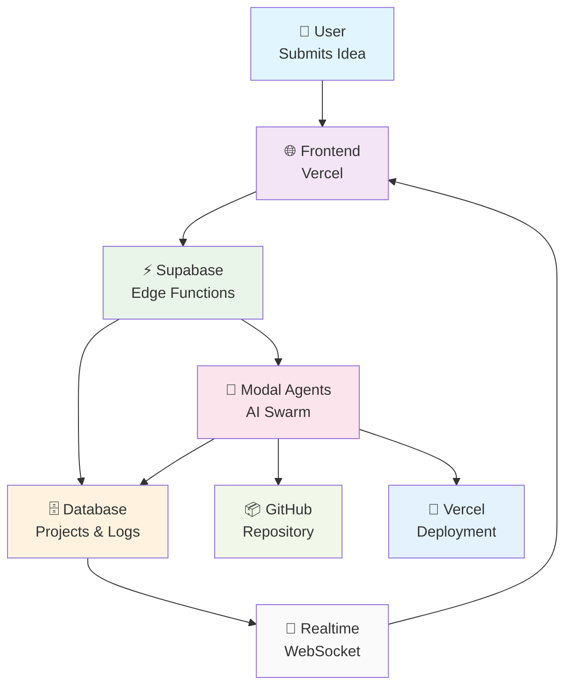

# my-yc: AI-Powered Startup Incubator

> Transform ideas into reality with autonomous AI agents. Be the YC of your own startup portfolio.

**my-yc** is a revolutionary platform that allows anyone to become their own Y Combinator. Users submit business ideas and receive fully autonomous AI agent swarms that handle everything from repository creation to deployment - creating complete startups with minimal human intervention.

## 🏗️ Architecture

### Production Architecture: Vercel + Supabase + Modal



### Key Features

- **🎯 Real-Time Monitoring**: SSH-like terminal experience with live log streaming
- **🤖 Autonomous Agents**: Embedded MCP tools for GitHub, databases, and deployments
- **💰 Zero Idle Costs**: Serverless architecture scales to zero when not in use
- **⚡ Instant Deployment**: From idea to live startup in minutes
- **📊 Portfolio Dashboard**: Manage multiple projects like a VC fund

## 🔄 How It Works

1. **💡 Submit Idea**: User describes their startup concept via the web interface
2. **⚡ Edge Function**: Supabase processes the request and triggers Modal agents
3. **🤖 AI Agents**: Autonomous swarm creates GitHub repo, sets up Next.js project, and configures deployment
4. **📺 Live Monitoring**: Real-time terminal output streams via WebSocket (like Lovable)
5. **🚀 Ready to Deploy**: Complete startup with one-click Vercel deployment

## 🛠️ Tech Stack

### Frontend (Vercel)
- **Framework**: Next.js 14 with App Router
- **Styling**: Tailwind CSS + shadcn/ui components
- **Real-time**: Supabase WebSocket subscriptions
- **Deployment**: Vercel (automatic from GitHub)

### Backend (Supabase)
- **Database**: PostgreSQL with real-time subscriptions
- **Edge Functions**: Serverless API endpoints (Deno runtime)
- **Auth**: Built-in authentication system
- **Real-time**: WebSocket broadcasting

### AI Agents (Modal)
- **Runtime**: Isolated Python containers
- **Framework**: Custom agent orchestration
- **MCP Tools**: Embedded GitHub, Supabase, Vercel integrations
- **Scaling**: Auto-sleep when idle (zero cost)

## 📁 Project Structure

```
my-yc/
├── frontend/                    # Next.js app (deploy to Vercel)
│   ├── app/                    # Next.js 14 App Router
│   ├── components/             # React components + shadcn/ui
│   └── package.json           # Frontend dependencies
├── backend/
│   └── agents/                 # Modal AI agents
│       ├── modal_spawner.py   # Main deployment + web endpoints
│       ├── github_agent.py    # Repository creation agent
│       ├── supabase_integration.py  # Real-time logging
│       └── mcp_tools/         # Embedded MCP integrations
└── ARCHITECTURE.md            # Detailed implementation guide
```

## 🚀 Quick Start

### Prerequisites
- Node.js 18+
- Modal account (free tier available)
- Supabase project
- GitHub token for my-yc-creator account

### 1. Deploy Frontend
```bash
cd frontend/
npm install
npm run build
vercel deploy
```

### 2. Set Up Supabase
```sql
-- Run in Supabase SQL Editor
CREATE TABLE projects (
  id UUID PRIMARY KEY DEFAULT gen_random_uuid(),
  title TEXT NOT NULL,
  description TEXT,
  status TEXT DEFAULT 'spawning',
  progress INTEGER DEFAULT 0,
  github_url TEXT,
  created_at TIMESTAMPTZ DEFAULT NOW()
);

CREATE TABLE project_logs (
  id UUID PRIMARY KEY DEFAULT gen_random_uuid(),
  project_id UUID REFERENCES projects(id),
  agent_name TEXT NOT NULL,
  level TEXT DEFAULT 'info',
  message TEXT NOT NULL,
  timestamp TIMESTAMPTZ DEFAULT NOW()
);

-- Enable realtime
ALTER PUBLICATION supabase_realtime ADD TABLE project_logs;
```

### 3. Deploy Modal Agents
```bash
cd backend/agents/

# Set up secrets
modal secret create my-yc-secrets \
  GITHUB_TOKEN=your_github_token \
  SUPABASE_URL=your_supabase_url \
  SUPABASE_ANON_KEY=your_anon_key

# Deploy agents
modal deploy modal_spawner.py
```

### 4. Configure Edge Functions
Create Supabase Edge Function to connect frontend → Modal:

```javascript
// supabase/functions/spawn_project/index.ts
serve(async (req) => {
  const { title, description } = await req.json()

  // Create project record
  const { data: project } = await supabase
    .from('projects')
    .insert({ title, description })
    .select()
    .single()

  // Trigger Modal agents
  await fetch('https://your-modal-app--spawn-project-web.modal.run/spawn', {
    method: 'POST',
    body: JSON.stringify({
      project_id: project.id,
      config: { title, description }
    })
  })

  return new Response(JSON.stringify({ project_id: project.id }))
})
```

## 🌟 Example Workflow

```bash
# User submits: "AI Recipe Recommender for health-conscious users"

# Real-time terminal output:
🤖 [github] INFO: Creating repository: ai-recipe-recommender-abc123
🤖 [github] INFO: Repository created: https://github.com/my-yc-creator/ai-recipe-recommender-abc123
🤖 [github] INFO: Setting up Next.js project structure
🤖 [github] SUCCESS: Created 8 files (package.json, app/page.tsx, etc.)
🤖 [github] INFO: Enhanced README with deployment instructions
🤖 [github] SUCCESS: Project completed - ready for deployment!

# Result: Complete startup ready for one-click Vercel deployment
```

## 🚦 Development Status

- ✅ **Frontend**: Complete Next.js app with real-time monitoring
- ✅ **Modal Agents**: GitHub agent with embedded MCP tools
- ✅ **Architecture**: Production-ready Vercel + Supabase + Modal
- 🔄 **In Progress**: Supabase Edge Functions
- 🔄 **Planned**: Database agent, deployment agent, email agent

## 📄 License

MIT License - Build the future freely.

---

**Ready to become your own Y Combinator?**

Transform your ideas into autonomous startups today! 🚀