# my-yc: AI-Powered Startup Incubator

> Transform ideas into reality with autonomous AI agents. Be the YC of your own startup portfolio.

**my-yc** is a revolutionary platform that allows anyone to become their own Y Combinator. Users submit business ideas and receive fully autonomous AI agent swarms that handle everything from repository creation to deployment - creating complete startups with minimal human intervention.

## 🏗️ Architecture

### Production Architecture: Vercel + Supabase + Modal

```mermaid
graph TD
    A[👤 User<br/>Submits Idea] --> B[🌐 Frontend<br/>Vercel]
    B --> C[⚡ Supabase<br/>Edge Functions]
    C --> D[🗄️ Database<br/>Projects & Logs]
    C --> E[🤖 Modal Agents<br/>AI Swarm]
    E --> F[📦 GitHub<br/>Repository]
    E --> G[🚀 Vercel<br/>Deployment]
    E --> D
    D --> H[📡 Realtime<br/>WebSocket]
    H --> B

    style A fill:#e1f5fe
    style B fill:#f3e5f5
    style C fill:#e8f5e8
    style D fill:#fff3e0
    style E fill:#fce4ec
    style F fill:#f1f8e9
    style G fill:#e3f2fd
    style H fill:#fafafa
```



### Key Features

- **🎯 Real-Time Monitoring**: SSH-like terminal experience with live log streaming
- **🤖 Autonomous Agents**: Embedded MCP tools for GitHub, databases, and deployments
- **💰 Zero Idle Costs**: Serverless architecture scales to zero when not in use
- **⚡ Instant Deployment**: From idea to live startup in minutes
- **📊 Portfolio Dashboard**: Manage multiple projects like a VC fund

## 🔄 How It Works

1. **💡 Submit Idea**: User describes their startup concept via the web interface
2. **⚡ Edge Function**: Supabase processes the request and triggers Modal agents
3. **🤖 AI Agents**: Autonomous swarm creates GitHub repo, sets up Next.js project, and configures deployment
4. **📺 Live Monitoring**: Real-time terminal output streams via WebSocket (like Lovable)
5. **🚀 Ready to Deploy**: Complete startup with one-click Vercel deployment

## 🛠️ Tech Stack

### Frontend (Vercel)
- **Framework**: Next.js 14 with App Router
- **Styling**: Tailwind CSS + shadcn/ui components
- **Real-time**: Supabase WebSocket subscriptions
- **Deployment**: Vercel (automatic from GitHub)

### Backend (Supabase)
- **Database**: PostgreSQL with real-time subscriptions
- **Edge Functions**: Serverless API endpoints (Deno runtime)
- **Auth**: Built-in authentication system
- **Real-time**: WebSocket broadcasting

### AI Agents (Modal)
- **Runtime**: Isolated Python containers
- **Framework**: Custom agent orchestration
- **MCP Tools**: Embedded GitHub, Supabase, Vercel integrations
- **Scaling**: Auto-sleep when idle (zero cost)

## 📁 Project Structure

```
my-yc/
├── frontend/                    # Next.js app (deploy to Vercel)
│   ├── app/                    # Next.js 14 App Router
│   ├── components/             # React components + shadcn/ui
│   └── package.json           # Frontend dependencies
├── backend/
│   └── agents/                 # Modal AI agents
│       ├── modal_spawner.py   # Main deployment + web endpoints
│       ├── github_agent.py    # Repository creation agent
│       ├── supabase_integration.py  # Real-time logging
│       └── mcp_tools/         # Embedded MCP integrations
└── ARCHITECTURE.md            # Detailed implementation guide
```

## 🚀 Quick Start

### Prerequisites
- Node.js 18+
- Modal account (free tier available)
- Supabase project
- GitHub token for my-yc-creator account

### 1. Deploy Frontend
```bash
cd frontend/
npm install
npm run build
vercel deploy
```

### 2. Set Up Supabase
```sql
-- Run in Supabase SQL Editor
CREATE TABLE projects (
  id UUID PRIMARY KEY DEFAULT gen_random_uuid(),
  title TEXT NOT NULL,
  description TEXT,
  status TEXT DEFAULT 'spawning',
  progress INTEGER DEFAULT 0,
  github_url TEXT,
  created_at TIMESTAMPTZ DEFAULT NOW()
);

CREATE TABLE project_logs (
  id UUID PRIMARY KEY DEFAULT gen_random_uuid(),
  project_id UUID REFERENCES projects(id),
  agent_name TEXT NOT NULL,
  level TEXT DEFAULT 'info',
  message TEXT NOT NULL,
  timestamp TIMESTAMPTZ DEFAULT NOW()
);

-- Enable realtime
ALTER PUBLICATION supabase_realtime ADD TABLE project_logs;
```

### 3. Deploy Modal Agents
```bash
cd backend/agents/

# Set up secrets
modal secret create my-yc-secrets \
  GITHUB_TOKEN=your_github_token \
  SUPABASE_URL=your_supabase_url \
  SUPABASE_ANON_KEY=your_anon_key

# Deploy agents
modal deploy modal_spawner.py
```

### 4. Configure Edge Functions
Create Supabase Edge Function to connect frontend → Modal:

```javascript
// supabase/functions/spawn_project/index.ts
serve(async (req) => {
  const { title, description } = await req.json()

  // Create project record
  const { data: project } = await supabase
    .from('projects')
    .insert({ title, description })
    .select()
    .single()

  // Trigger Modal agents
  await fetch('https://your-modal-app--spawn-project-web.modal.run/spawn', {
    method: 'POST',
    body: JSON.stringify({
      project_id: project.id,
      config: { title, description }
    })
  })

  return new Response(JSON.stringify({ project_id: project.id }))
})
```

## 🌟 Example Workflow

```bash
# User submits: "AI Recipe Recommender for health-conscious users"

# Real-time terminal output:
🤖 [github] INFO: Creating repository: ai-recipe-recommender-abc123
🤖 [github] INFO: Repository created: https://github.com/my-yc-creator/ai-recipe-recommender-abc123
🤖 [github] INFO: Setting up Next.js project structure
🤖 [github] SUCCESS: Created 8 files (package.json, app/page.tsx, etc.)
🤖 [github] INFO: Enhanced README with deployment instructions
🤖 [github] SUCCESS: Project completed - ready for deployment!

# Result: Complete startup ready for one-click Vercel deployment
```

## 🚦 Development Status

- ✅ **Frontend**: Complete Next.js app with real-time monitoring
- ✅ **Modal Agents**: GitHub agent with embedded MCP tools
- ✅ **Architecture**: Production-ready Vercel + Supabase + Modal
- 🔄 **In Progress**: Supabase Edge Functions
- 🔄 **Planned**: Database agent, deployment agent, email agent

## 🔮 Future Plans: Persistent Virtual Companies

### The Vision
Transform each startup into a **persistent virtual software company** with autonomous AI agents that maintain identity, workspace, and memory across sessions. Not simulations - real teams producing real code.

### Architecture Overview

```
Each Startup Gets:
├── Persistent Workspace (Modal Volume)
│   ├── /workspace/{startup_id}/
│   │   ├── github_repo/      # Active codebase
│   │   ├── docs/             # Documentation
│   │   └── data/             # Databases, configs
│   ├── /memory/
│   │   ├── ceo/              # CEO identity & decisions
│   │   ├── frontend_agent/   # Frontend agent state
│   │   ├── backend_agent/    # Backend agent state
│   │   └── team_chat/        # Inter-agent communication
│   └── /mcp/
│       └── config.json       # MCP tool configuration
```

### Key Features (Coming Soon)

#### 🧠 **Persistent Identity**
- Agents remember all conversations and context
- Maintain personality and decision history
- Learn from experience and improve over time

#### 💼 **Real Workspaces**
- Actual file systems with code and documentation
- Git repositories agents actively develop
- Shared workspace for team collaboration

#### 🛠️ **MCP Tool Integration**
- File editing capabilities in workspace
- Git operations (commit, branch, merge)
- Terminal access for build and test
- Database operations

#### 👥 **Autonomous Teams**
- CEO spawns specialized agents based on needs
- Frontend, Backend, Database, DevOps agents
- Agents communicate and coordinate
- Work continues even when founders are offline

#### 📊 **Event-Driven Execution**
- Agents sleep when idle (cost-effective)
- Wake on founder messages or scheduled tasks
- Daily standups and progress reports
- Continuous integration and deployment

### Implementation Roadmap

**Phase 1: CEO Persistence** *(✅ COMPLETED)*
- ✅ CEO creates GitHub repositories
- ✅ Team planning capability
- ✅ Persistent conversation memory
- ✅ Workspace initialization
- ✅ Modal Volume integration
- ✅ Supabase workspace tracking
- ✅ State save/load across restarts

**Phase 2: MCP Tool Integration** *(🎯 NEXT - DETAILED PLAN BELOW)*
- Real workspace operations
- File editing capabilities
- Git repository management
- Terminal command execution
- GitHub API integration

**Phase 3: Agent Team**
- Base persistent agent class
- Specialized agent types
- Inter-agent communication
- Task distribution system

**Phase 4: Autonomous Operations**
- Scheduled work cycles
- Code review processes
- Continuous development
- Self-improving capabilities

---

## 🛠️ Phase 2 Detailed Implementation Plan: MCP Tool Integration

### Overview
Transform CEOs from conversational agents into **productive virtual developers** who can actually work in their GitHub repositories, edit code, run tests, and coordinate real development activities.

### Core Objective
Give each CEO **real tools** to operate in their persistent workspace, enabling them to:
- Clone and edit their GitHub repositories
- Create, modify, and commit code files
- Run terminal commands (build, test, deploy)
- Manage project dependencies and configuration
- Coordinate with future team agents through shared workspace

### Architecture Design

#### MCP (Model Context Protocol) Integration
```python
# Each CEO gets access to these tool categories:
MCP_TOOLS = {
    "filesystem": ["read_file", "write_file", "list_directory", "create_directory"],
    "git": ["clone_repo", "commit_changes", "push_changes", "create_branch"],
    "terminal": ["run_command", "install_dependencies", "run_tests"],
    "github": ["create_issue", "create_pr", "manage_repo_settings"],
    "workspace": ["sync_state", "backup_workspace", "restore_from_backup"]
}
```

#### Workspace Structure Enhancement
```
/workspace/{startup_id}/
├── github_repo/              # ← ACTIVE: Cloned and editable
│   ├── src/                  # ← CEO can edit these files
│   ├── package.json          # ← CEO can modify dependencies
│   ├── README.md             # ← CEO maintains project docs
│   └── .git/                 # ← Full git history and operations
├── tools/
│   ├── mcp_config.json       # ← Tool configurations
│   ├── terminal_history.log  # ← Command history
│   └── build_logs/           # ← Build and test outputs
├── memory/
│   ├── ceo/
│   │   ├── work_sessions.jsonl    # ← Track what CEO has worked on
│   │   ├── code_changes.log       # ← Log of all code modifications
│   │   └── technical_decisions.md # ← Technical architecture decisions
│   └── shared/
│       ├── project_status.json    # ← Current project state
│       └── todo_list.json         # ← Active development tasks
└── coordination/
    ├── agent_assignments.json     # ← Future: Tasks for team agents
    ├── code_review_queue.json     # ← Files needing review
    └── deployment_config.json     # ← Deployment settings
```

### Implementation Steps

#### Step 1: Core MCP Tool Framework (Day 1)
**File: `backend/agents/mcp_tools/base_mcp.py`**
```python
class BaseMCPTool:
    """Base class for all MCP tools with workspace context."""

    def __init__(self, workspace_path: Path, startup_id: str):
        self.workspace = workspace_path
        self.startup_id = startup_id
        self.github_repo_path = workspace_path / "github_repo"
        self.tools_path = workspace_path / "tools"

    async def execute(self, action: str, **kwargs) -> Dict[str, Any]:
        """Execute tool action with full error handling and logging."""

    def log_activity(self, activity_type: str, details: Dict[str, Any]):
        """Log all tool usage for debugging and coordination."""
```

#### Step 2: File System Operations (Day 1)
**File: `backend/agents/mcp_tools/filesystem_tools.py`**
```python
class FileSystemMCP(BaseMCPTool):
    async def read_file(self, file_path: str) -> Dict[str, Any]:
        """Read any file in the workspace with safety checks."""

    async def write_file(self, file_path: str, content: str, create_dirs: bool = True) -> Dict[str, Any]:
        """Create or modify files with backup and version tracking."""

    async def list_directory(self, dir_path: str = "") -> Dict[str, Any]:
        """List files and directories with metadata."""

    async def create_react_component(self, component_name: str, props: List[str]) -> Dict[str, Any]:
        """High-level: Create a React component with boilerplate."""

    async def update_package_json(self, dependencies: Dict[str, str]) -> Dict[str, Any]:
        """High-level: Add/update npm dependencies safely."""
```

#### Step 3: Git Repository Management (Day 2)
**File: `backend/agents/mcp_tools/git_tools.py`**
```python
class GitMCP(BaseMCPTool):
    async def clone_repository(self, repo_url: str, branch: str = "main") -> Dict[str, Any]:
        """Clone the GitHub repo into workspace/github_repo/."""

    async def commit_changes(self, message: str, files: List[str] = None) -> Dict[str, Any]:
        """Commit specific files or all changes with detailed logging."""

    async def push_changes(self, branch: str = "main") -> Dict[str, Any]:
        """Push commits to GitHub with error handling."""

    async def create_branch(self, branch_name: str, from_branch: str = "main") -> Dict[str, Any]:
        """Create feature branches for specific work."""

    async def get_repo_status(self) -> Dict[str, Any]:
        """Get detailed git status, recent commits, and branch info."""

    async def create_pull_request(self, title: str, description: str, base: str = "main") -> Dict[str, Any]:
        """Create PR using GitHub API integration."""
```

#### Step 4: Terminal Command Execution (Day 2)
**File: `backend/agents/mcp_tools/terminal_tools.py`**
```python
class TerminalMCP(BaseMCPTool):
    async def run_command(self, command: str, cwd: str = None, timeout: int = 60) -> Dict[str, Any]:
        """Execute terminal commands with output capture and safety limits."""

    async def install_dependencies(self, package_manager: str = "npm") -> Dict[str, Any]:
        """Run npm install, pip install, etc. with caching."""

    async def run_tests(self, test_pattern: str = None) -> Dict[str, Any]:
        """Execute test suites and capture results."""

    async def build_project(self, build_command: str = "npm run build") -> Dict[str, Any]:
        """Build the project and capture build artifacts."""

    async def start_dev_server(self) -> Dict[str, Any]:
        """Start development server (for testing/preview)."""
```

#### Step 5: GitHub API Integration (Day 3)
**File: `backend/agents/mcp_tools/github_tools.py`**
```python
class GitHubMCP(BaseMCPTool):
    async def create_issue(self, title: str, description: str, labels: List[str] = None) -> Dict[str, Any]:
        """Create GitHub issues for bug tracking and feature requests."""

    async def manage_repository_settings(self, settings: Dict[str, Any]) -> Dict[str, Any]:
        """Update repo description, topics, settings."""

    async def get_repository_insights(self) -> Dict[str, Any]:
        """Get commit history, contributors, file changes."""

    async def setup_github_actions(self, workflow_type: str) -> Dict[str, Any]:
        """Create CI/CD workflows (test, build, deploy)."""
```

#### Step 6: High-Level Workspace Operations (Day 3)
**File: `backend/agents/mcp_tools/workspace_tools.py`**
```python
class WorkspaceMCP(BaseMCPTool):
    async def sync_workspace_with_github(self) -> Dict[str, Any]:
        """Ensure workspace and GitHub repo are in sync."""

    async def backup_workspace(self) -> Dict[str, Any]:
        """Create timestamped backup of entire workspace."""

    async def restore_workspace(self, backup_id: str) -> Dict[str, Any]:
        """Restore workspace from backup."""

    async def get_project_health(self) -> Dict[str, Any]:
        """Analyze project: dependencies, tests, build status, git health."""

    async def setup_project_structure(self, project_type: str) -> Dict[str, Any]:
        """Initialize proper folder structure for React, Node.js, etc."""
```

#### Step 7: CEO Agent Integration (Day 4)
**Update: `backend/agents/ceo_agent.py`**
```python
class CEOAgent:
    def __init__(self, startup_id: str, design_doc: Dict[str, Any], workspace_manager=None):
        # ... existing init ...

        # Initialize MCP tools
        if self.workspace_path:
            self.mcp_tools = {
                "filesystem": FileSystemMCP(self.workspace_path, startup_id),
                "git": GitMCP(self.workspace_path, startup_id),
                "terminal": TerminalMCP(self.workspace_path, startup_id),
                "github": GitHubMCP(self.workspace_path, startup_id),
                "workspace": WorkspaceMCP(self.workspace_path, startup_id)
            }

    async def handle_work_request(self, task_description: str) -> Dict[str, Any]:
        """Handle requests like 'add a contact form' or 'fix the styling'."""

    async def clone_and_setup_repo(self) -> Dict[str, Any]:
        """Clone the GitHub repo into workspace after initialization."""

    async def work_on_feature(self, feature_description: str) -> Dict[str, Any]:
        """High-level feature implementation using multiple MCP tools."""
```

### Tool Usage Examples

#### Example 1: CEO Adds Contact Form
```python
# User: "Can you add a contact form to our app?"
# CEO's internal process:

# 1. Analyze current project structure
project_status = await self.mcp_tools["workspace"].get_project_health()

# 2. Create contact form component
component_result = await self.mcp_tools["filesystem"].create_react_component(
    "ContactForm",
    ["name", "email", "message"]
)

# 3. Add form validation dependencies
deps_result = await self.mcp_tools["filesystem"].update_package_json({
    "formik": "^2.2.9",
    "yup": "^0.32.11"
})

# 4. Install new dependencies
install_result = await self.mcp_tools["terminal"].install_dependencies()

# 5. Run tests to ensure nothing broke
test_result = await self.mcp_tools["terminal"].run_tests()

# 6. Commit changes
commit_result = await self.mcp_tools["git"].commit_changes(
    "Add contact form component with validation",
    ["src/components/ContactForm.jsx", "package.json"]
)

# 7. Push to GitHub
push_result = await self.mcp_tools["git"].push_changes()
```

#### Example 2: CEO Fixes Styling Issues
```python
# User: "The mobile layout is broken, can you fix it?"
# CEO's internal process:

# 1. Examine current CSS files
css_files = await self.mcp_tools["filesystem"].list_directory("src/styles")

# 2. Read existing styles
main_css = await self.mcp_tools["filesystem"].read_file("src/styles/main.css")

# 3. Update CSS with mobile-first responsive design
updated_css = "/* CEO-generated mobile-responsive styles */"
await self.mcp_tools["filesystem"].write_file("src/styles/main.css", updated_css)

# 4. Test the changes locally
build_result = await self.mcp_tools["terminal"].build_project()

# 5. Commit and push fixes
await self.mcp_tools["git"].commit_changes("Fix mobile responsive layout issues")
await self.mcp_tools["git"].push_changes()
```

### Security & Safety Features

#### File System Safety
- **Workspace Boundaries**: All operations restricted to `/workspace/{startup_id}/`
- **Backup Before Changes**: Automatic versioning of modified files
- **Dangerous Command Prevention**: Blacklist of destructive commands
- **Resource Limits**: File size limits, command timeouts

#### Git Safety
- **Branch Protection**: Never force-push to main branch
- **Commit Verification**: Ensure commits are meaningful and tested
- **Conflict Resolution**: Automatic handling of merge conflicts

#### Access Control
- **Tool Permissions**: Each tool has specific permission boundaries
- **Audit Logging**: All tool usage logged for debugging
- **Rate Limiting**: Prevent excessive API calls or resource usage

### Testing Strategy

#### Unit Tests for Each Tool
- **Mock Workspaces**: Test tool operations in isolated environments
- **Error Handling**: Test failure scenarios and recovery
- **Integration Tests**: Test tool combinations

#### End-to-End Scenarios
- **Feature Implementation**: "Add authentication system"
- **Bug Fixing**: "Fix deployment pipeline"
- **Maintenance Tasks**: "Update dependencies"

### Success Metrics

#### Functional Metrics
- ✅ CEO can clone and modify GitHub repositories
- ✅ CEO can run tests and build projects
- ✅ CEO can commit and push changes successfully
- ✅ All operations are logged and auditable

#### User Experience Metrics
- ✅ Founders can request features and see real code changes
- ✅ CEOs provide detailed progress reports with links to commits
- ✅ Projects remain in working state after CEO modifications

### Phase 2 Completion Criteria

1. **Core Tools Implemented**: Filesystem, Git, Terminal, GitHub, Workspace
2. **CEO Integration Complete**: CEOs can use all tools seamlessly
3. **Safety Systems Active**: All security and backup systems working
4. **End-to-End Testing**: Real feature development scenarios proven
5. **Documentation Updated**: Complete tool reference and examples

### Expected Timeline
- **Day 1**: Core MCP framework + File operations
- **Day 2**: Git + Terminal tools
- **Day 3**: GitHub API + Workspace tools
- **Day 4**: CEO integration + Testing
- **Day 5**: Polish, documentation, deployment

### Next Phase Preview
**Phase 3** will use these same MCP tools to enable **team agents** (Frontend Agent, Backend Agent, etc.) to collaborate in the shared workspace, with the CEO coordinating their efforts. Phase 3 will also include:

- **Workspace Retention Policies**: Automatic cleanup of inactive workspaces
- **Resource Management**: Optimized storage and compute allocation
- **Advanced Analytics**: Team performance metrics and insights

---

### Technical Stack

- **Storage**: Modal Volumes for persistent workspaces
- **State Management**: JSON/JSONL for agent memories
- **Tools**: MCP (Model Context Protocol) for file/git/terminal operations
- **Orchestration**: Event-driven Modal functions
- **Database**: Supabase for state snapshots and coordination

### Why This Matters

Traditional AI coding assistants are stateless and disconnected. Our virtual companies are:

1. **Persistent**: They remember everything and maintain context
2. **Autonomous**: They work independently toward goals
3. **Collaborative**: Multiple agents coordinate like real teams
4. **Productive**: They produce real code in real repositories
5. **Scalable**: Hundreds of virtual companies, each in their own workspace

### The Beautiful Part

When a founder asks *"How's the project going?"*, the CEO can:
- Look at actual code in the workspace
- Check notes from team members
- Review commit history
- Show real progress

It's not a simulation - it's a real virtual software company.

## 📄 License

MIT License - Build the future freely.

---

**Ready to become your own Y Combinator?**

Transform your ideas into autonomous startups today! 🚀